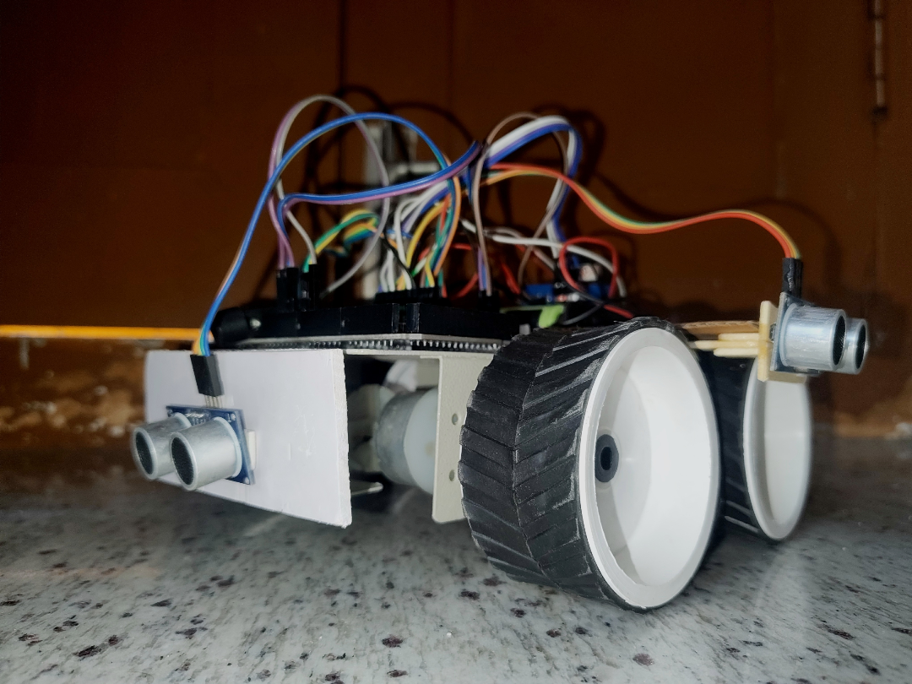

# Autonomous_Obstacle_Avoiding_360-
Arduino-based autonomous vehicle with full-perimeter (360°) situational awareness. Utilizes 4x HC-SR04 ultrasonic sensors for advanced obstacle detection and priorities-based navigation. Built on Arduino Mega + L298N driver.
# 🏎️ 360° Autonomous Sensor Vehicle

## Overview
This repository contains the firmware and documentation for an **Autonomous Sensor Vehicle**. The primary objective was to engineer a robot capable of complete situational awareness. It is equipped with four HC-SR04 ultrasonic sensors, oriented 90 degrees apart (Front, Back, Left, Right), providing full-perimeter detection and priority-based navigation.

The system uses a variable speed, smooth-braking firmware structure to manage inertial momentum, ensuring stable operation even in complex environments.

---

## 🛠️ Technical Highlights

* **ECE Engineering Project:** Developed as a practical application of embedded systems and real-time sensor integration.
* **Full-Perimeter Awareness (360° Sonar Array):** Developed a scanning algorithm that fuses data from four sensors simultaneously, rather than a single front-facing sensor.
* **Proportional Inertia Management (PWM):** Implemented via the L298N's enable pins. The vehicle calculates speed based on obstacle proximity, scaling down speed from 100% to 30% before making full stops to prevent skidding.
* **Priority-Based Logic Control (PBLC):** The main control loop prioritizes the safety-interrupt state (Front danger zone + Buzzer warning) over movement commands.

## 🏗️ Hardware Architecture

### Components Used:
* **Microcontroller:** Arduino Mega (required for multiple PWM pins and extra digital I/O).
* **Motor Driver:** L298N H-Bridge Module (ENA/ENB speed control enabled).
* **Sensors:** * 4x HC-SR04 Ultrasonic Sensors.
    * 1x Active Buzzer (for proximity audio feedback).
* **Power System:** Dual-supply setup.
    * 7.4V (2S Li-ion) for the L298N motor driver.
    * 9V separate supply for the Arduino logic.
* **Chassis:** 4WD Car Robot Kit.

### Pin Mapping Overview:
| Component | Function | Pins |
| :--- | :--- | :--- |
| HC-SR04 (Front) | Trig/Echo | D2 / D3 |
| HC-SR04 (Back) | Trig/Echo | D4 / D7 |
| HC-SR04 (Left) | Trig/Echo | D8 / D9 |
| HC-SR04 (Right) | Trig/Echo | A0 / A1 (used digitally) |
| Active Buzzer | Audio Feedback | A2 |
| L298N Driver | Speed (ENA/ENB) | D5 / D6 (PWM) |
| L298N Driver | Direction (IN1-IN4)| D10-D13 |

---

## 🚀 Navigation Logic Flow

1. **Clear Path:** All sensors read distance > `thresholdF_low`. **Command:** `moveForward(speed_max)`.
2. **Proximity Warning:** Front sensor reads distance between `thresholdF_low` and `thresholdF_stop`. **Command:** `moveForward(speed_slow)`, activate intermittent buzzer beep.
3. **Obstacle Confirmed:** Front sensor reads distance < `thresholdF_stop`. **Action:** Initiate full stop. Activate constant buzzer tone.
4. **Scan and Pivot:** Vehicle initiates a reverse maneuver. It then simultaneously checks the `distL` and `distR` sensors. It executes a sharp turn toward the direction with the greatest obstacle clearance.
5. **Resume:** Main loop re-initializes.

---

## 💻 Getting Started

1.  **Clone the Repository:** `git clone https://github.com/username/autonomous-sensor-vehicle.git`
2.  **Required Tools:** Install the Arduino IDE. No external libraries are required.
3.  **Circuit Assembly:** Refer to the wiring diagram in the `(assets/)` folder (Common Ground connection is mandatory).
4.  **Flash:** Open `auton_vehicle.ino`, select **Arduino Mega 2560** in the IDE, and upload the code.

---

## 💡 Key Troubleshooting (Lessons Learned)

* **The "Semaphore Timeout" Error:** This error (common on inexpensive clones or when pins 0/1 are occupied) was resolved by disconnecting the Serial RX/TX pins during the upload process.
* **Voltage Drop and Common Ground:** The L298N introduces a 2V drop. To ensure PWM control worked consistently, the external battery pack's ground, the L298N's ground terminal, and the Arduino's ground were connected together (**Common Ground**).
* **Sensor Noise:** When all four sensors fire simultaneously, ultrasonic interference (cross-talk) can occur. This was mitigated by adding a subtle `delay(20)` between each sensor pulse.

---

### **License**
This project is licensed under the MIT License - see the `(LICENSE.md)` file for details.
